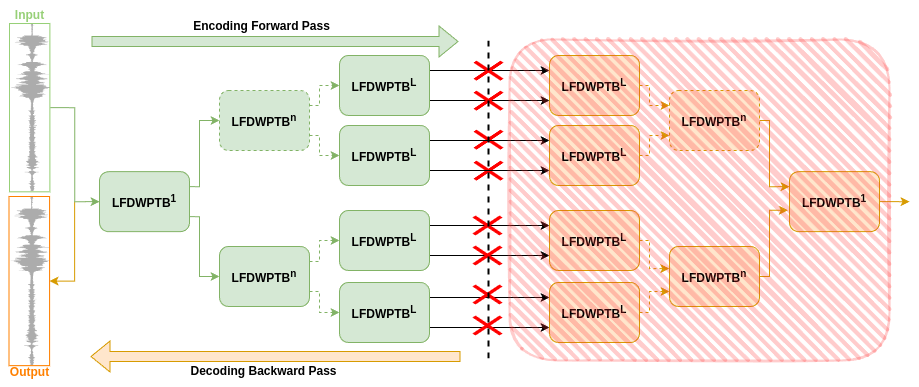
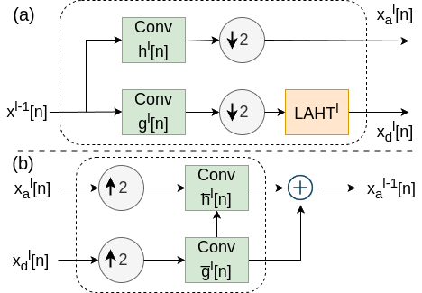
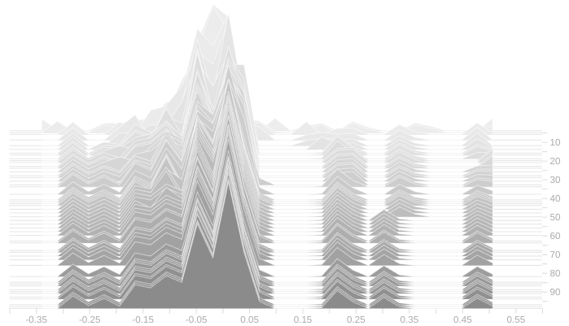
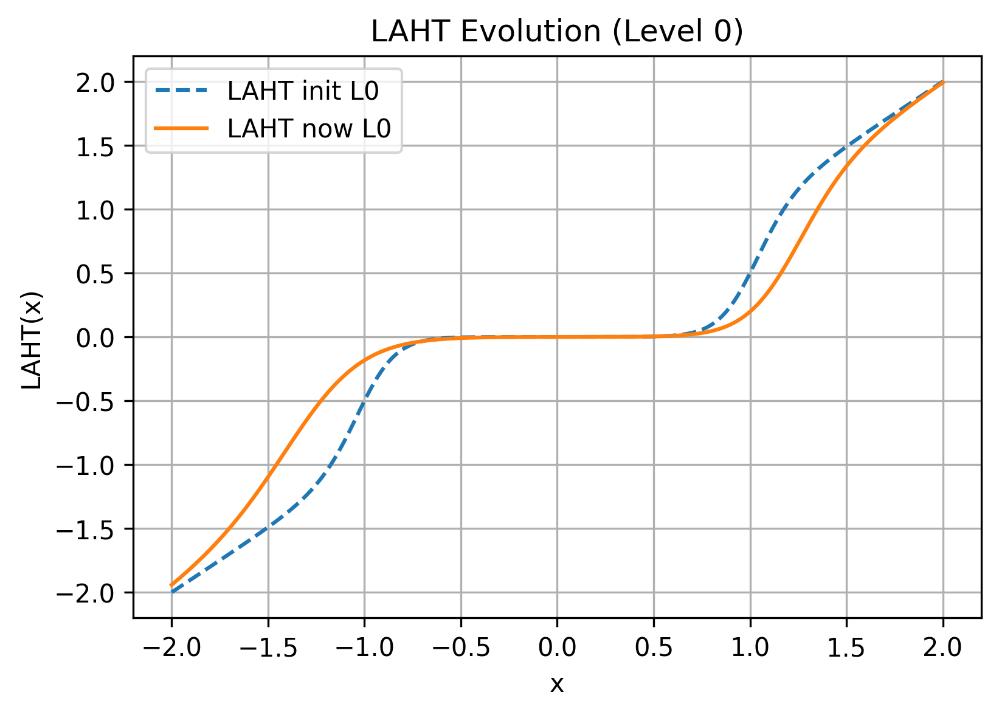

<!-- PROJECT LOGO -->
<br />
<div align="center">
  <a href="https://github.com/alaaNfissi/Neural-Wavelet-Packet-Based-Bidirectional-Autoencoder-for-Multi-Resolution-Speech-Enhancement">
    
  </a>

  <h3 align="center">Neural Wavelet Packet-Based Bidirectional Autoencoder for Multi-Resolution Speech Enhancement</h3>

  <p align="center">
    This paper has been submitted for publication in the 38th Canadian Conference on Artificial Intelligence (Canadian AI 2025) .
    <br />
  </p>
</div>

<div align="center">

[](https://github.com/alaaNfissi/Neural-Wavelet-Packet-Based-Bidirectional-Autoencoder-for-Multi-Resolution-Speech-Enhancement/#readme "Go to project documentation")

</div>  

<div align="center">
    <p align="center">
    ·
    <a href="https://github.com/alaaNfissi/Neural-Wavelet-Packet-Based-Bidirectional-Autoencoder-for-Multi-Resolution-Speech-Enhancement/issues">Report Bug</a>
    ·
    <a href="https://github.com/alaaNfissi/Neural-Wavelet-Packet-Based-Bidirectional-Autoencoder-for-Multi-Resolution-Speech-Enhancement/issues">Request Feature</a>
  </p>
</div>

This repository implements **NWPA**, a novel speech enhancement model described in the paper:

> *"Neural Wavelet Packet-Based Bidirectional Autoencoder for Multi-Resolution Speech Enhancement."* 

NWPA integrates:
- **Bidirectional Autoencoder**: A single network for both encoding and decoding.
- **Learnable Fast Discrete Wavelet Packet Transform (LFDWPT)**: Trains wavelet filters adaptively.
- **Conjugate Quadrature Filters (CQF)** property for orthogonal decomposition.
- **Learnable Asymmetric Hard Thresholding (LAHT)** for dynamic noise suppression.
- **Sparsity-Enforcing Loss Function (SELF)** for balancing reconstruction and sparsity.

## Contents
<details>
  <summary><strong>Table of Contents</strong></summary>
  <ol>
    <li><a href="#abstract">Abstract</a></li>
    <li><a href="#built-with">Built With</a></li>
    <li><a href="#overview">Overview</a></li>
    <li><a href="#figures">Figures</a></li>
    <li><a href="#comparison-with-state-of-the-art">Comparison with State-of-the-Art</a></li>
    <li><a href="#installation">Installation</a></li>
    <li><a href="#usage">Usage</a></li>
    <li><a href="#project-structure">Project Structure</a></li>
    <li><a href="#paper-reference">Paper Reference</a></li>
    <li><a href="#contributing">Contributing</a></li>
    <li><a href="#license">License</a></li>
  </ol>
</details>

---

## Abstract
*Speech enhancement is a critical challenge in signal processing, particularly in noisy environments where preserving intelligibility and perceptual quality is essential. Conventional deep learning-based models operate solely in the time or frequency domain, our approach employs an adaptive multi-resolution framework, enabling superior noise suppression while preserving crucial speech structures across different frequency bands. To this end, we introduce the **Neural Wavelet Packet-Based Bidirectional Autoencoder (NWPA)**, a novel framework for multi-resolution speech enhancement. NWPA leverages the Fast Discrete Wavelet Packet Transform with trainable filters that jointly decompose both approximation and detail sub-bands, capturing richer time-frequency features than traditional fixed-wavelet approaches. A bidirectional autoencoder design reduces parameter overhead by unifying the encoding and decoding stages, while an improved Learnable Asymmetric Hard Thresholding function adaptively suppresses noise in the wavelet domain. Furthermore, a Sparsity-Enforcing Loss Function balances reconstruction fidelity with wavelet sparsity, preserving critical speech components across multiple resolutions. Comprehensive evaluations on the VoiceBank-DEMAND dataset demonstrate NWPA’s state-of-the-art performance, underscoring its effectiveness in both noise reduction and intelligibility preservation. These results highlight NWPA’s potential as a robust and scalable solution for speech enhancement under diverse noise conditions.*

---

## Built With

### Tools and Libraries

- 
- 
- 
- 
- 
- 
- 
- 

---

## Overview

**NWPA** is designed for **speech denoising** and **multi-resolution signal analysis**.  

Key features:
- **Bidirectional Autoencoder** → same weights for encoder and decoder (50% fewer trainable params).
- **Adaptive Wavelet Packet Decomposition** → uses learnable filters (LFDWPT) to capture both approximation and detail coefficients.
- **LAHT** → robust thresholding for effective noise suppression.
- **SELF** → balances time-domain fidelity with wavelet-domain sparsity.

**Dataset**: Evaluated on the [VoiceBank-DEMAND dataset](https://datashare.ed.ac.uk/handle/10283/2791).  
**Performance**: Achieves state-of-the-art performance in metrics such as PESQ, STOI, CSIG, CBAK, and COVL.

---

## Figures

### NWPA Architecture
<p align="center">
  
</p>

**Figure 1**. High-level architecture of NWPA integrating bidirectional autoencoding with learnable wavelet packet decomposition and LAHT.

### Encoder-Decoder Block
<p align="center">
  
</p>

**Figure 2**. Detailed view of the encoder-decoder block within NWPA.

### Wavelet Filter Evolution
<p align="center">
  
</p>

**Figure 3**. Evolution of the wavelet filters during training, showing adaptive learning of multiresolution features.

### LAHT Evolution
<p align="center">
  
</p>

**Figure 4**. Dynamic evolution of the Learnable Asymmetric Hard Thresholding (LAHT) parameters during training.

---

## Comparison with State-of-the-Art

| **Model**                 | **COVL** | **CBAK** | **CSIG** | **STOI** | **PESQ** |
|---------------------------|----------|----------|----------|----------|----------|
| **Noisy**                 | 2.63     | 2.44     | 3.35     | 0.91     | 1.97     |
| MUSE [1]                  | 4.10     | 3.80     | 4.63     | 0.95     | 3.37     |
| MetricGAN+ [2]            | 3.64     | 3.16     | 4.14     | -        | 3.15     |
| SEMamba [3]               | 4.26     | 3.98     | 4.75     | 0.96     | 3.52     |
| TSTNN [4]                 | 3.67     | 3.53     | 4.33     | 0.95     | 2.96     |
| DPCFCS-Net [5]            | 4.15     | 3.88     | 4.71     | 0.96     | 3.42     |
| CMGAN [6]                 | 4.12     | 3.94     | 4.63     | 0.96     | 3.41     |
| S4ND U-Net [7]            | 3.85     | 3.62     | 4.52     | -        | 3.15     |
| Mamba-SEUNet [8]          | 4.32     | 4.02     | 4.80     | 0.96     | 3.59     |
| MP-SENet [9]              | 4.22     | 3.95     | 4.73     | 0.96     | 3.50     |
| **WEBA (Ours)**     | **4.40** | **4.20** | **4.85** | **0.97** | **3.78** |

**Table 1**. Comparison of NWPA with state-of-the-art models on the VoiceBank-DEMAND dataset.

---

## Installation

1. **Clone** the repository:
   ```bash
   git clone https://github.com/alaaNfissi/Neural-Wavelet-Packet-Based-Bidirectional-Autoencoder-for-Multi-Resolution-Speech-Enhancement.git
   cd Neural-Wavelet-Packet-Based-Bidirectional-Autoencoder-for-Multi-Resolution-Speech-Enhancement
   ```
2. (Optional) Create a **virtual environment**:
   ```bash
   python -m venv venv
   source venv/bin/activate   # On Windows: venv\Scripts\activate
   ```
3. **Install** dependencies:
   ```bash
   pip install -r requirements.txt
   ```
4. (Optional) **Install** the package:
   ```bash
   pip install -e .
   ```

---

## Usage

1. **Configure** data paths and hyperparameters in `src/config.py`.
2. **Train** the model:
   ```bash
   python src/main.py
   ```
   TensorBoard logs will be saved in the `runs/` directory under a group name (e.g., `WaveletExp_YYYYMMDD_HHMMSS_Valentini`).
3. **Run Tests**:
   ```bash
   pytest tests/
   ```
4. **Hyperparameter Grid Search** (optional, using Ray Tune):
   The grid search will run automatically if configured.

---

## Project Structure

```
my-wavelet-ae/
├── .gitignore
├── .env.example
├── README.md
├── requirements.txt
├── setup.py
├── src
│   ├── __init__.py
│   ├── config.py
│   ├── main.py
│   ├── data
│   │   ├── __init__.py
│   │   └── dataset.py
│   ├── models
│   │   ├── __init__.py
│   │   └── wavelet_packet_ae.py
│   └── utils
│       ├── __init__.py
│       ├── transform_pipeline.py
│       └── train_eval.py
└── tests
    └── test_wavelet_packet_ae.py
```

---

## Contributing

Contributions are what make the open source community such an amazing place to learn, inspire, and create. Any contributions you make are **greatly appreciated**.

If you have a suggestion that would make this better, please fork the repo and create a pull request. You can also simply open an issue with the tag "enhancement".  
Don't forget to give the project a star! Thanks again!

1. Fork the Project  
2. Create your Feature Branch (`git checkout -b feature/AmazingFeature`)  
3. Commit your Changes (`git commit -m 'Add some AmazingFeature'`)  
4. Push to the Branch (`git push origin feature/AmazingFeature`)  
5. Open a Pull Request 

---

## License

This project is licensed under the [BSD 3-Clause License](LICENSE.md). You can freely use and modify the code, provided that you give appropriate credit to the original authors. See `LICENSE.md` for the full license text.

---

## References

1. [Lin et al., 2024] MUSE: Flexible voiceprint receptive fields and multi-path fusion enhanced Taylor transformer for U-Net-based speech enhancement.
2. [Fu et al., 2021] MetricGAN+: An improved version of MetricGAN for speech enhancement.
3. [Chao et al., 2024] Investigation of incorporating Mamba for speech enhancement.
4. [Wang et al., 2021] TSTNN: Two-stage transformer based neural network for speech enhancement in the time domain.
5. [Wang et al., 2023] DPCFCS-Net: Efficient encoder-decoder and dual-path conformer for comprehensive feature learning in speech enhancement.
6. [Cao et al., 2022] CMGAN: Conformer-based metric GAN for speech enhancement.
7. [Ku et al., 2023] S4ND U-Net: A multi-dimensional deep structured state space approach to speech enhancement.
8. [Wang et al., 2024] Mamba-SEUNet: Mamba U-Net for monaural speech enhancement.
9. [Lu et al., 2023] MP-SENet: A speech enhancement model with parallel denoising of magnitude and phase spectra.